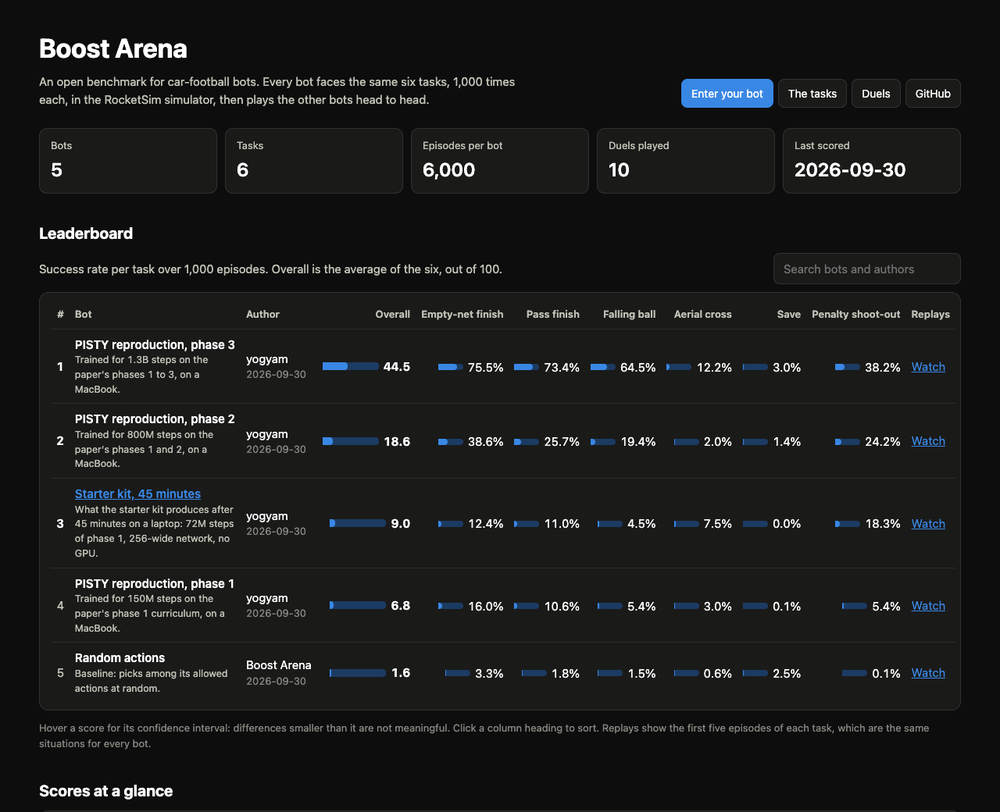
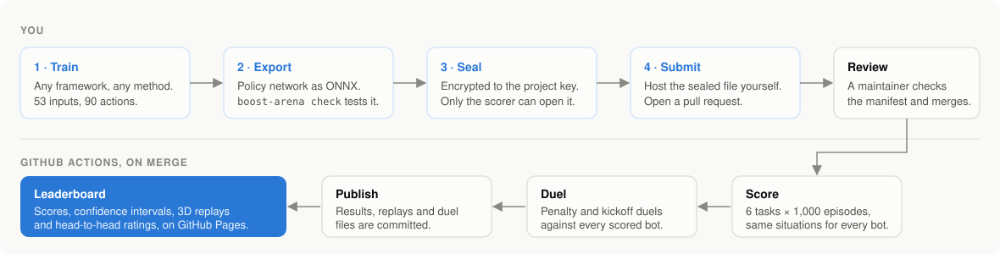
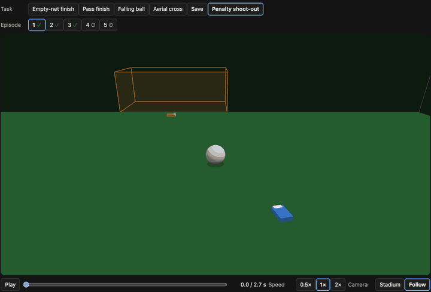

# Boost Arena

An open benchmark for car-football bots. Train a bot however you like, submit the trained model, and see how it scores on a set of fixed tasks.

Bots are scored in [RocketSim](https://github.com/ZealanL/RocketSim), an open-source simulator of Rocket League's physics. The game itself is never run.

> **Status: open for entries.** Scoring, submissions, the leaderboard, replays, duels and a training starter kit all work.

<p align="center"><a href="https://yogyam.github.io/boost-arena/"></a></p>

## How it works

<p align="center"></p>

1. **Everyone uses the same interface.** A bot sees 53 numbers describing the ball and cars, and picks one of 90 actions, 15 times a second. See [docs/INTERFACE.md](docs/INTERFACE.md).
2. **You train your own way.** Any framework, any method, any hardware.
3. **You submit one model file**, in ONNX format, sealed so that only the scoring service can open it. No code is submitted or run, and the project never publishes your model.
4. **Every bot faces the same situations** and gets a success rate and a time to score for each task.
5. **The leaderboard** is at https://yogyam.github.io/boost-arena/ and is rebuilt after every scoring run. Every bot's first five episodes of each task can be watched in the browser, and they are the same situations for every bot.

To enter, see [docs/SUBMITTING.md](docs/SUBMITTING.md).

Every scored bot's first episodes can be watched in the browser, in 3D:

<p align="center"><a href="https://yogyam.github.io/boost-arena/replay.html?bot=pisty-reproduction-phase-3"></a></p>

## Try it

Needs Python 3.11 or newer. Works on Linux, macOS (Apple Silicon) and Windows.

```bash
git clone https://github.com/yogyam/boost-arena.git
cd boost-arena
pip install -e .

boost-arena tasks                       # List the tasks
boost-arena make-random-bot random.onnx # A bot that acts at random, to try things out
boost-arena check my_bot.onnx           # Is this file an acceptable submission?
boost-arena score my_bot.onnx           # Score it on every task
```

Example output, for a bot trained for 1.3 billion steps:

```
Task                  Success   95% interval    Time to score   Own goal  Out of time
Empty-net finish        77.9%   75.2% to 80.4%          6.0 s          0          221
Pass finish             71.2%   68.3% to 73.9%          6.2 s          1          287
Falling ball            64.2%   61.2% to 67.1%         10.4 s          0          358
Aerial cross            12.1%   10.2% to 14.3%          9.0 s          0          879
Save                     3.0%   2.1% to 4.3%                         970            0
Penalty shoot-out       37.4%   34.5% to 40.4%          3.1 s          0          626

Overall score: 44.3 out of 100
```

Scoring a bot takes about four minutes on a laptop. A bot that acts at random scores about 2.

Scores from your own machine are for your own use. Official leaderboard scores will come from the project's scoring service, because results can differ slightly between computers.

## Tasks

| Task | The bot must | Opponent | Time limit |
|---|---|---|---|
| Empty-net finish | Score from a still ball | None | 20 s |
| Pass finish | Score from a ball rolling in from the wing | None | 20 s |
| Falling ball | Score from a ball dropping out of the air | None | 20 s |
| Aerial cross | Score from a high cross | None | 15 s |
| Save | Keep out a shot that is on target | None | 6 s |
| Penalty shoot-out | Score from a still ball | The reference keeper | 10 s |

<p align="center"></p>

Each task is played 1,000 times. The overall score is the average success rate, out of 100. See [docs/TASKS.md](docs/TASKS.md) for the details, including how the reference keeper behaves.

This is how the bots on the leaderboard do so far. Nobody can make a save yet.

<p align="center"></p>

## Duels

Scored bots also play each other: a penalty duel, attacking then defending, and a kickoff duel. The results give every bot a head-to-head rating, shown below the task leaderboard. See [docs/DUELS.md](docs/DUELS.md).

## Training a bot

Don't have a bot yet? The starter kit trains one on your own computer with reinforcement learning and exports it as a submission: see [docs/STARTER_KIT.md](docs/STARTER_KIT.md).

## Making a model file

If you trained with GigaLearnCPP, convert a checkpoint with:

```bash
pip install torch
python tools/convert_gigalearn_checkpoint.py path/to/checkpoint my_bot.onnx
```

From any other framework, export your policy network to ONNX with an input of shape (N, 53) and an output of shape (N, 90). The output is one logit per action. Masking and choosing the action are done by the benchmark.

## Rules

See [RULES.md](RULES.md). In short: the project is free and non-commercial, bots are for the simulator and for research, nothing here may be used to play online against people, and the project never publishes model files.

## Tests

```bash
pip install -e ".[dev]"
pytest
```

## Credits and licences

Boost Arena is released under the [MIT licence](LICENSE). It builds on the work of others: see [CREDITS.md](CREDITS.md).

## Disclaimer

Boost Arena is a fan project. It is not affiliated with Psyonix or Epic Games.

Portions of the materials used are trademarks and/or copyrighted works of Epic Games, Inc. All rights reserved by Epic. This material is not official and is not endorsed by Epic.
