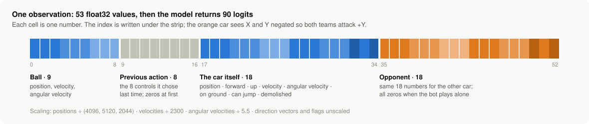

# The Boost Arena interface, version 1

This is the contract between a bot and the benchmark: what the bot is told, what it can do, and the physics it plays under. Every bot on the leaderboard uses the same interface.

The reference implementation is [`src/boost_arena/interface.py`](../src/boost_arena/interface.py) and [`src/boost_arena/sim.py`](../src/boost_arena/sim.py). If this document and the code disagree, the code is right and the document has a bug.

## Summary

| | |
|---|---|
| Format | 1v1, or one car alone |
| Input | 53 numbers (32-bit floats) |
| Output | One score ("logit") for each of 90 actions |
| Decisions | 15 per second (every 8 simulator ticks) |
| Action delay | 7 ticks |
| Boost | Effectively unlimited |
| Car | Plank hitbox |
| Simulator | RocketSim 2.2.1, Soccar arena, 120 ticks per second |

## The model file

A submission is one ONNX file with:

| | Name | Type | Shape |
|---|---|---|---|
| Input | any | float32 | (N, 53) |
| Output | any | float32 | (N, 90) |

N is the number of cars being decided at once and must be left open.

The model returns logits. The benchmark, not the model, turns them into an action: it removes the actions the car can't take (see [Action mask](#action-mask)), then either draws an action at random in proportion to the softmax probabilities, or takes the most likely one. Official scores draw at random, as bots do in training.

The model has no memory between decisions. Only feed-forward operations are accepted, the file must be self-contained, and it must be under 64 MB with at most 16 million parameters. `boost-arena check model.onnx` tells you whether a file is acceptable.

## Coordinates

Distances are in Unreal units (1 unit is 1 cm). Z is up. The blue goal is at Y = -5120 and the orange goal at Y = +5120.

**The orange car sees the field turned by half a turn.** For an orange car, the X and Y parts of every position, velocity, angular velocity and direction vector are negated. Both teams therefore see themselves attacking +Y, and one model can play either side.

## Observation

53 numbers, in this order:

| Index | Count | Content | Scaling |
|---|---|---|---|
| 0–2 | 3 | Ball position | X / 4096, Y / 5120, Z / 2044 |
| 3–5 | 3 | Ball velocity | / 2300 |
| 6–8 | 3 | Ball angular velocity | / 5.5 |
| 9–16 | 8 | The car's own previous action | none |
| 17–34 | 18 | The car itself | see below |
| 35–52 | 18 | The opponent | see below; all zero if there is no opponent |

Each car block is 18 numbers:

| Offset | Count | Content | Scaling |
|---|---|---|---|
| 0–2 | 3 | Position | X / 4096, Y / 5120, Z / 2044 |
| 3–5 | 3 | Forward direction (unit vector) | none |
| 6–8 | 3 | Up direction (unit vector) | none |
| 9–11 | 3 | Velocity | / 2300 |
| 12–14 | 3 | Angular velocity | / 5.5 |
| 15 | 1 | On the ground (three or more wheels touching) | 0 or 1 |
| 16 | 1 | Can jump or flip | 0 or 1 |
| 17 | 1 | Demolished | 0 or 1 |

The previous action is the eight controls of the action the car chose at its last decision, in the order given under [Actions](#actions). It is all zeros at the first decision of an episode.

Boost amounts and boost pads are not part of the observation, because boost doesn't run out.

## Actions

An action is eight controls:

| Index | Control | Values |
|---|---|---|
| 0 | Throttle | -1, 0, 1 |
| 1 | Steer | -1, 0, 1 |
| 2 | Pitch | -1, 0, 1 |
| 3 | Yaw | -1, 0, 1 |
| 4 | Roll | -1, 0, 1 |
| 5 | Jump | 0, 1 |
| 6 | Boost | 0, 1 |
| 7 | Handbrake | 0, 1 |

The 90 actions are a fixed table, built in this order.

**Ground actions, indices 0–23.** For throttle in (-1, 0, 1), then steer in (-1, 0, 1), then boost in (0, 1), then handbrake in (0, 1), innermost last. Combinations with boost on and throttle not 1 are skipped. Yaw copies steer. Pitch, roll and jump are 0.

**Aerial actions, indices 24–89.** For pitch in (-1, 0, 1), then yaw, then roll, then jump in (0, 1), then boost in (0, 1), innermost last. Skipped: jump on with yaw not 0, and pitch, roll and jump all 0. Throttle copies boost and steer copies yaw. Handbrake is on when jump is on and at least one of pitch, yaw and roll is not 0.

The exact table is `ACTION_TABLE` in the reference implementation.

## Action mask

Not every action makes sense in every situation. The benchmark only lets the bot choose from the allowed ones:

1. **Start with the ground set or the air set.** On the ground: actions 0–23. In the air: aerial actions with jump off, plus the ground actions where throttle equals boost and handbrake is on exactly when yaw is not 0.
2. **If the car has no boost, remove every action with boost on.**
3. **If the car can jump or flip, or is lying on its roof, add every action with jump on.** A car counts as on its roof when it touches the arena and the contact surface's normal has Z above 0.9.

The steps are applied in that order, so step 3 can add back jump actions that use boost.

**Known quirk.** Action 24, the first aerial action, is never in the air set. The bots this interface was defined from were trained that way, so version 1 keeps it.

## Timing

The simulator runs at 120 ticks per second. At each decision:

1. The bot receives the observation and chooses an action.
2. The simulator advances 7 ticks with the car's previous controls still applied.
3. The new controls are applied.
4. The simulator advances 1 more tick.

A decision therefore takes effect 7 ticks (58 ms) after it is made, which stands in for a reaction time.

## Physics settings

| Setting | Value | Default |
|---|---|---|
| Boost used per second | 1 | 33.3 |
| Boost when a car spawns | 0 | 33.3 |
| Respawn after a demolition | Never | After 3 seconds |
| Car | Plank | |

Tasks start every car with 100 boost. At 1 per second it outlasts any episode.

Everything else is the simulator's default for Soccar.

## Demolitions

A demolished car is out for the rest of the episode. Its "demolished" flag is 1 and its position, direction and velocity stay as they were at the moment it was hit.

The simulator would normally bring the car back after three seconds, at a spawn point it picks at random. That choice can't be seeded, so with respawning on, scoring the same model twice could give different results.

## Clean starts

Every episode is played in a fresh copy of an untouched arena. Nothing from one episode, down to the state of a car's suspension, can affect another. An episode therefore plays out the same way whatever was played before it and however many episodes run side by side.

## Versions

Scores are only comparable within the same interface version, simulator version and task set. Every result records all three. Changing anything in this document means a new interface version.

## Where this interface comes from

Version 1 follows the setup described in the paper "PISTY: Curriculum-Based Deep Reinforcement Learning of Ground and Aerial Striking in 1v1 Rocket League" (Coelho et al., 2026), so that bots trained that way can enter. The implementation here was written from scratch and is tested against observations, masks and a game recorded from that training environment: see [`tests/`](../tests/).
