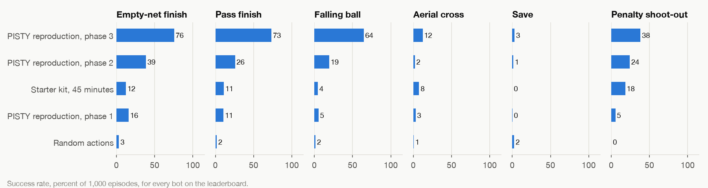

# Training your first bot

The starter kit trains a bot with reinforcement learning on your own computer, using the open RLGym tools, and turns it into a submission. It needs no graphics card: on a recent laptop it trains at 20,000 to 30,000 steps per second, so the first curriculum phase (150 million steps) takes about two hours.

It's a starting point, not a recipe for winning. The rewards, situations and network are all yours to change.

## Install

```bash
git clone https://github.com/yogyam/boost-arena.git
cd boost-arena
pip install -e ".[train]"
```

This adds PyTorch and the RLGym training library to the scoring tool. Python 3.11 or 3.12.

## Train

```bash
python -m boost_arena.starter.train --run my_first_bot
```

Training prints a report every 50,000 steps: steps per second, entropy, rewards. Stop with Ctrl+C whenever you like. Running the same command again resumes from the newest checkpoint.

Useful options:

| Option | Default | Meaning |
|---|---|---|
| `--processes N` | your core count minus 3 | Environment processes. More is faster, up to the number of cores |
| `--timesteps N` | 1,300,000,000 | Stop after this many steps |
| `--layers 256,256,256` | 256,256,256 | Hidden layer sizes of the policy network |
| `--learning-rate` | the phase's | Phase 1 uses 0.0002, later phases a little less |
| `--entropy` | 0.02 | Higher values explore more |
| `--device` | cpu | Where the network learns. `cuda` for an NVIDIA card |

Checkpoints and progress go under `runs/<name>/`.

## Export and submit

```bash
python -m boost_arena.starter.export --run my_first_bot my_first_bot.onnx
boost-arena check my_first_bot.onnx
boost-arena score my_first_bot.onnx --episodes 200
```

If you changed `--layers` when training, pass the same value to `export`. Then follow [SUBMITTING.md](SUBMITTING.md).

## What the kit does

**The environment follows the rulebook exactly.** The bot sees the 53 numbers described in [INTERFACE.md](INTERFACE.md), chooses among the 90 actions with the same mask, decides 15 times a second with the same 7-tick delay, drives the same car body, and has the same unlimited boost. A bot that plays well in training plays the same way when scored.

**Self-play.** Both cars in every game are driven by the same network, so the opponent improves as the bot does.

**A curriculum in three phases**, following the PISTY paper: first ball control, then ground scoring, then aerial play. Each phase changes the reward weights and the mix of situations, and sets a learning rate and discount. The phases switch at 150 million and 800 million steps. Reward weights and situations switch while training runs; the learning rate and discount are read when training starts or resumes, so stop and restart the run once it has crossed into a new phase to pick them up. See [`src/boost_arena/starter/curriculum.py`](../src/boost_arena/starter/curriculum.py); the weights are plain numbers you can edit.

**Situations from the benchmark itself.** From phase 2 the bot practises the benchmark's own task situations, drawn fresh each time, alongside kickoffs and random positions.

**What to expect.** The bot on the leaderboard called "Starter kit, 45 minutes" is what the kit produced after 72 million steps on a laptop, with nothing changed. The reproduction of the paper's full curriculum, trained for 1.3 billion steps, is the top entry; the gap between them is what training time and better rewards buy.



**The rewards** are a small set: touching the ball, hitting it hard, moving towards it, facing it, being in the air, speed, sending the ball towards the goal, and scoring. They live in [`src/boost_arena/starter/env.py`](../src/boost_arena/starter/env.py).

## Ideas for doing better

- **Reward what the tasks measure.** The Save task is where every baseline bot fails. A reward for keeping the ball out of your own goal, and more time in the `save` situation, would be a start.
- **Change the curriculum.** Longer or shorter phases, different weights, new situations.
- **A bigger network** learns more but trains slower on a CPU. `--layers 512,512,512` is a middle ground.
- **Train longer.** The baseline bots trained for 1.3 billion steps.

## Differences from the paper's setup

The kit is a fresh implementation, not the paper's code, which has no open licence. The main differences: the network is smaller by default (256 wide instead of 1,024), the reward set is shorter, there is no league of past opponents, and a car lying on its roof is detected from its orientation rather than from its contact with the floor.

## Problems

- **"Already inited"** or the simulator failing to start: another copy of the simulator was loaded in the same process. Restart Python.
- **Slow training**: check that `--processes` is not more than your number of cores, and that nothing else heavy is running.
- **Learning on Apple's GPU (`--device mps`)** is not recommended: the underlying library has numerical problems there. The CPU is fast enough.
