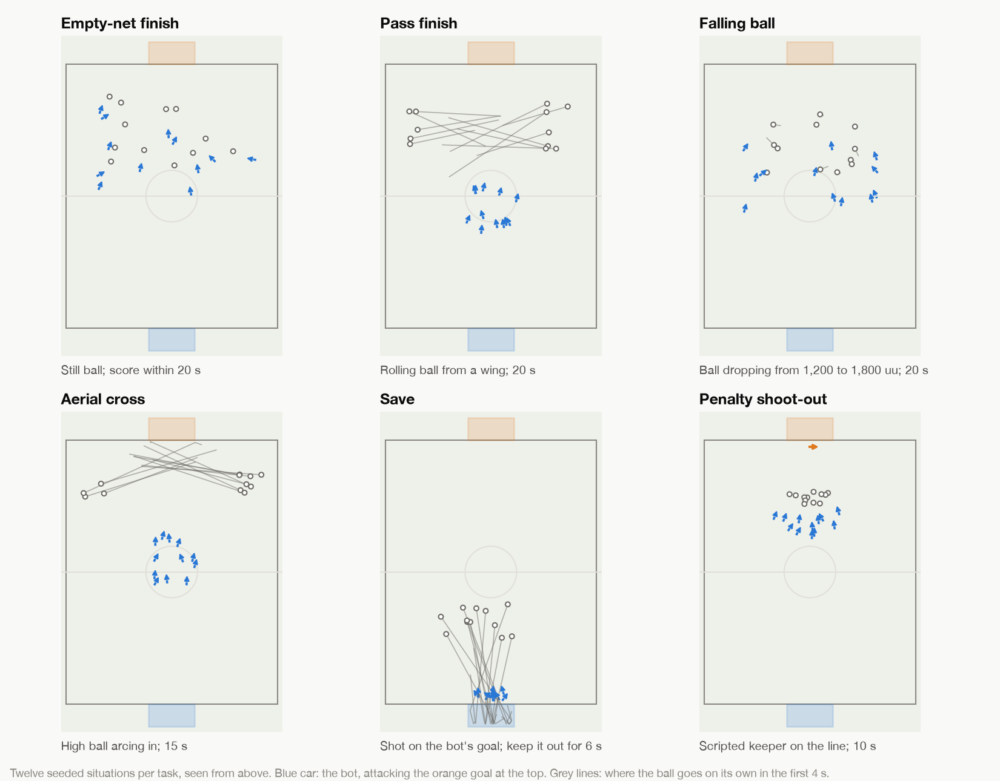

# The tasks, set 1

Six tasks. In each one the bot drives the blue car, attacks the goal at +Y and defends the one at -Y. The reference implementation is [`src/boost_arena/tasks.py`](../src/boost_arena/tasks.py).

| Task | The bot must | Opponent | Time limit |
|---|---|---|---|
| Empty-net finish | Score from a still ball | None | 20 s |
| Pass finish | Score from a ball rolling in from the wing | None | 20 s |
| Falling ball | Score from a ball dropping out of the air | None | 20 s |
| Aerial cross | Score from a high cross | None | 15 s |
| Save | Keep out a shot that is on target | None | 6 s |
| Penalty shoot-out | Score from a still ball | The reference keeper | 10 s |

## Scoring

Each task is played 1,000 times. An episode ends when the ball goes into a goal or the time runs out.

| Result | Counts as |
|---|---|
| The ball goes into the goal the bot attacks | Success |
| The ball goes into the bot's own goal | Failure |
| Time runs out | Failure, except in Save, where it is the success |

A bot's score on a task is its **success rate**. The **overall score** is the average of the six success rates, out of 100. Time to score is reported as well, and is not part of the score.

Every result comes with a 95% confidence interval. With 1,000 episodes it is about 3 points either side at a 50% success rate, so differences smaller than that between two bots are not meaningful.

## Fairness

- **Every bot faces the same 1,000 situations per task.** A situation is generated from the seed, the task and the episode number.
- **The bot's random choices are seeded too**, so scoring the same model twice on the same computer gives the same result.
- **Episodes don't affect each other.** Each one starts in a fresh copy of an untouched arena.
- **A score stands once given.** Different computers give slightly different results, because tiny differences in floating-point arithmetic grow over a 20-second episode. The scoring service runs on whatever machine GitHub provides, so scoring a model a second time there can move a task by a handful of episodes in a thousand and the overall score by a few tenths. A bot is scored once, when it is submitted or updated, and that score is its official one. The confidence interval says how precise any score is.
- **No free goals.** In the scoring tasks, a situation in which the ball would go in without being touched is thrown away and drawn again.
- **No impossible saves avoided.** In Save, every shot goes in if nobody touches it.

## The situations

Distances are in Unreal units. "Behind the ball" means on the side of the ball away from the goal the bot attacks.

### Empty-net finish
The ball is still, on the ground, anywhere in the attacking half between 1,000 and 4,000 units from the halfway line. The car is 700 to 1,500 behind it, within 40 degrees of the line from the goal through the ball, facing the ball to within 30 degrees, and not moving.

### Pass finish
The ball starts on a wing in the attacking half and rolls at 900 to 1,700 units per second towards the channel in front of the car, sometimes with a small bounce. The car is around the halfway line, facing the goal to within 25 degrees, moving at up to 600.

### Falling ball
The ball starts 1,200 to 1,800 units up, over the attacking half, falling at 400 to 1,200 with a little sideways drift. The car is 1,200 to 2,000 behind it, facing it, moving towards it at 400 to 900.

### Aerial cross
The ball starts on a wing near the attacking corner, 250 to 600 units up, and arcs towards the space in front of the goal. The car is around the halfway line, facing the goal to within 30 degrees, moving at up to 800. The ball comes down and bounces, so a bot that can't fly can still score, with less time.

### Save
The ball is shot at the bot's goal from 2,500 to 3,900 units out, at 1,400 to 2,600 units per second, aimed anywhere in the goal mouth up to 500 units high. The car is in the goal mouth, facing the ball to within 30 degrees. The bot succeeds if the ball is not in its goal after six seconds.

### Penalty shoot-out
The ball is still, 1,700 to 2,500 units from the goal and up to 800 either side of centre. The car is 900 to 1,500 behind it, facing it to within 15 degrees. The reference keeper is in goal.

Demolishing the keeper is allowed. It stays out for the rest of the episode.

## The reference keeper

The keeper is a fixed program, not a trained model: see [`src/boost_arena/keeper.py`](../src/boost_arena/keeper.py). It behaves the same for every bot and never changes.

It sits across the goal mouth, side on to the shooter, and drives along the goal line to stay in front of where the ball is heading. For a ball arriving too high to block from the ground it takes a small hop, a full jump or a double jump, timed to meet the ball at the right height. It never leaves its line, never boosts and never comes out.

It is meant to be beatable. Measured over 200 shots of each kind that were on target:

| Shot | Beat the keeper |
|---|---|
| Slow, central, low | 1% |
| Fast, central, low | 5% |
| Medium pace, central, head high | 10% |
| Fast, into the corners, low | 44% |
| Medium pace, top of the goal | 83% |

So power down the middle is not enough. A bot has to place its shot.

## Versions

This is task set 1. Changing a task, a time limit, the keeper or the number of episodes makes a new task set, and results from different task sets are not compared.
